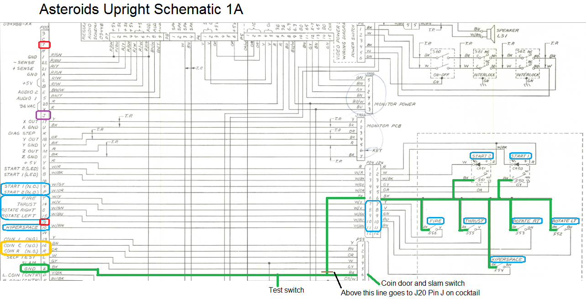
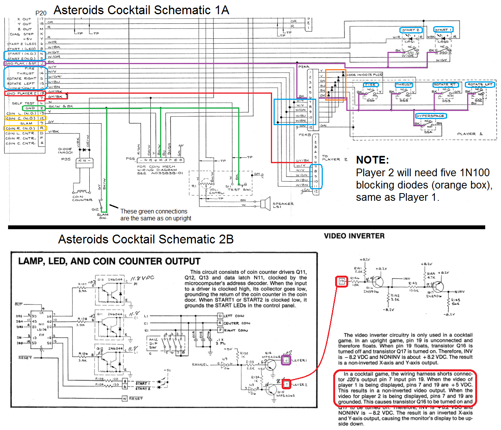
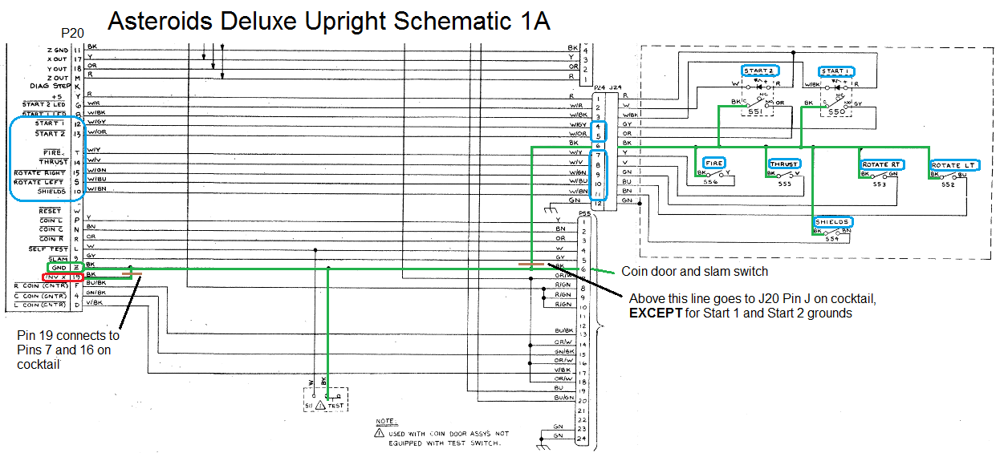
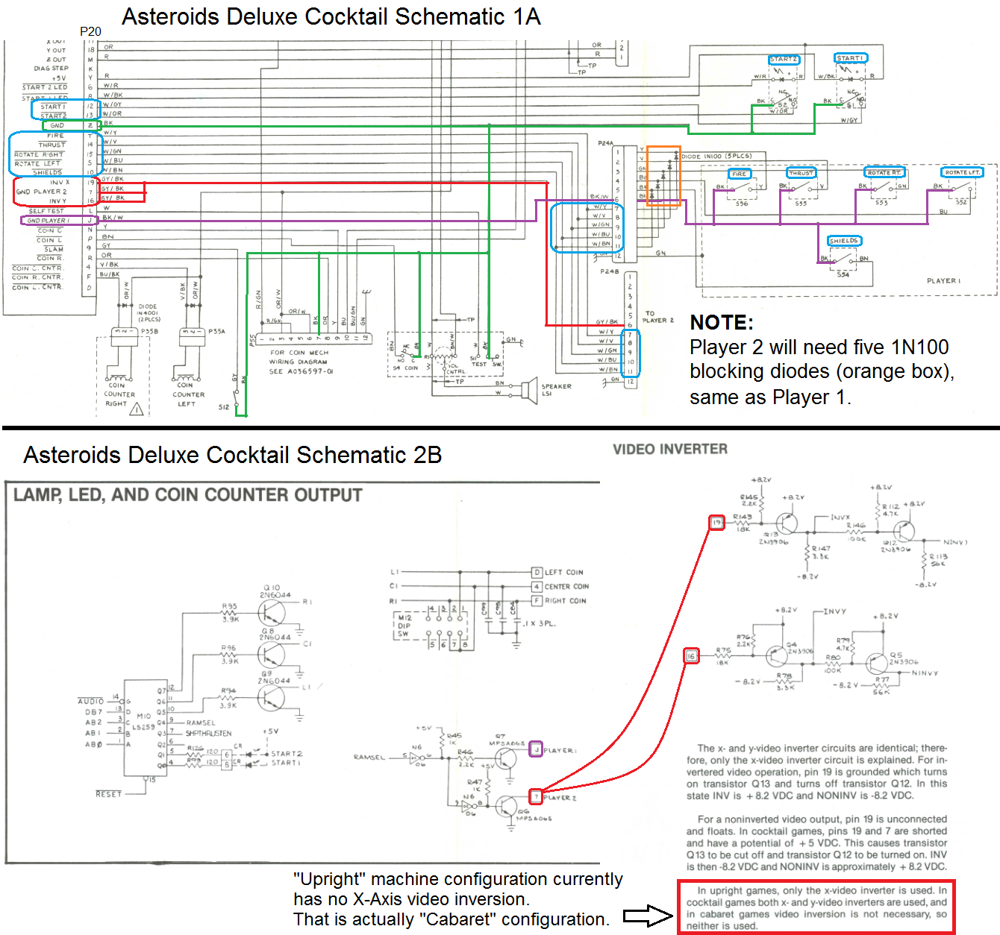
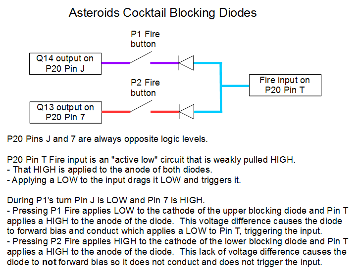

# MAME-Asteroids-Cocktail-Info
TL;DR summary:

MAME currently doesn't have separate P2 controls for Asteroids and Asteroids Deluxe.  It needs P2 inputs added to input menu, 10 blocking diodes added, and the ground source for the inputs changed.

The text file describes what changes need to be made to MAME and why.  It refers to the color-coded schematics and has links to the high-quality, easy-to-read original schematics.

The info was developed in this thread.  https://forum.arcadecontrols.com/index.php/topic,168028.0.html

------------------------------------------

Which MAME ROMs worked with Asteroids cocktail cabinets:
--------------------------------------------------------

https://www.ukvac.com/forum/threads/asteroids-cocktail-resets-and-flicker.81215/

<blockquote>
I have a version -04 PCB with 035143/44/45-02 ROM chips.
</blockquote>

These chip numbers correspond to "asteroid2" ROM numbers, so that confirms that the "asteroid" (Rev. 4) and "asteroid2" (Rev. 2) ROMs supported cocktail switching. NOTE: There is no Rev. 3 ROMset.

I haven't found anything showing that the "asteroid1" (Rev. 1) ROMs could support cocktail switching, but early PCB versions definitely did not.

https://forums.arcade-museum.com/threads/wtb-asteroids-cocktail-pcb.395749/

<blockquote>
There are multiple versions of Asteroids PCBs. Some of them lack the image flipping circuitry in the video section, which the cocktail requires. These boards are meant for upright cabs only.

To tell the difference, the upright-only boards have 4066's and TL082's behind the video adjustment pots (4 chips total), while the boards with the flipping circuitry have 4016's, TL081's and TL082's (6 chips total).
</blockquote>

**NOTE: MAME currently supports Machine Config Cocktail for asteroid, asteroid1, and asteroid2**

---------------------------------------------

Which MAME ROMs worked with Asteroids Deluxe cocktail cabinets?
---------------------------------------------------------------

The latest revision "astdelux" (Rev. 3) definitely would have.

Not sure about "astdelux2" or "astdelux1", but it is likely that they did due to the release date.  More research is needed to confirm.

**NOTE: MAME currently supports Machine Config Cocktail for astdelux, astdelux1, and astdelux2**

----------------------------------------------

Other suggested changes
-----------------------

Current Machine Config "Upright" for Asteroids Deluxe is actually the configuration for the Cabaret (non-mirrored) version of the cab.  Not sure what Machine Config names should be used for the two upright versions of the cab -- Upright (mirror cab) and Cabaret. (non-mirror cab)

It might be a good idea to update the Input menu button labels.
- Button 1 (Left)
- Button 2 (Right)
- Button 3 (Fire)
- Button 4 (Thrust)
- Button 5 (Hyperspace/Shield)

When in Machine Config Cocktail, "astdelux1" initializes the screen upside-down on system start or F3 reset.  Starting a game fixes it until you F3 reset or exit the game and restart it.  This possible bug does not happen in "astdelux" or "astdelux2".  Need to confirm if this happened on actual hardware. (I think I remember reading about someone having this problem, but don't remember where or in what context.)

-----------------------------------------------

-and-Cabaret-(No-Mirror).png)

