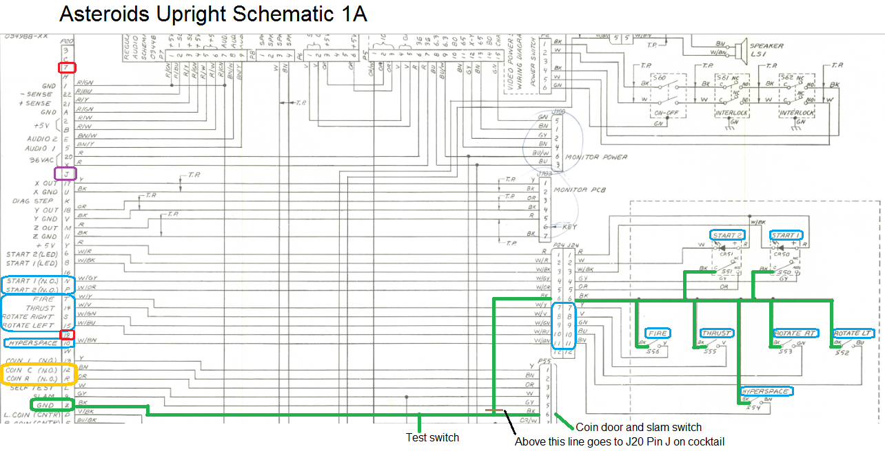
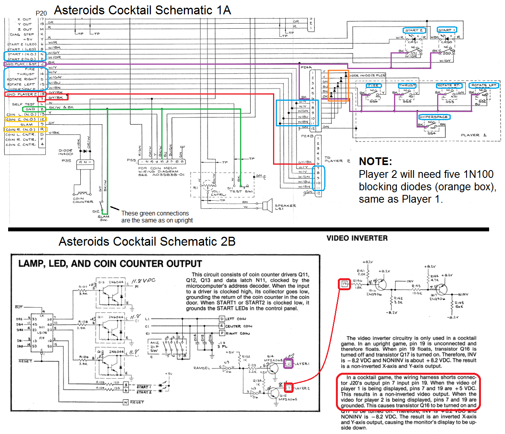
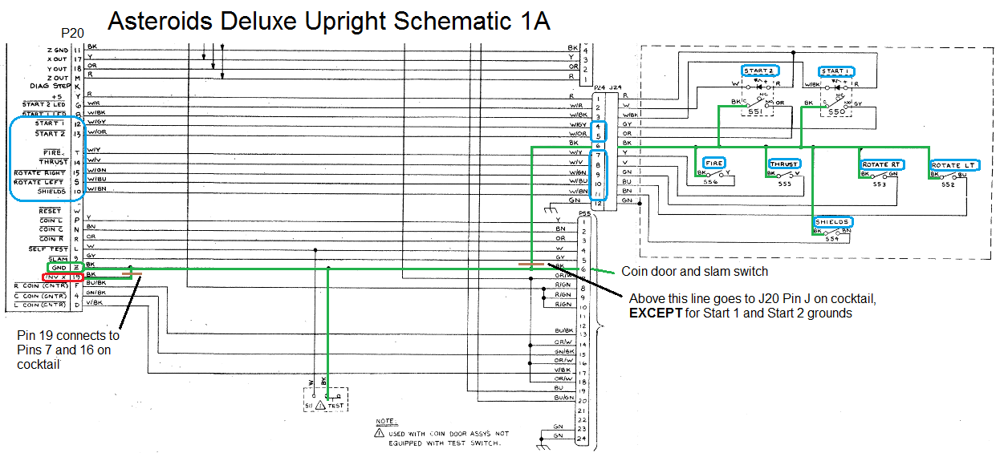

# MAME-Asteroids-Cocktail-Info
TL;DR summary:

MAME currently doesn't have separate P2 controls for Asteroids and Asteroids Deluxe.  It needs P2 inputs added to input menu, 10 blocking diodes added, and the ground source for the inputs changed.

Current Machine Config "Upright" for Asteroids Deluxe is actually the configuration for the Cabaret (non-mirrored) version of the cab.  Not sure what Machine Config names should be used for the two upright versions of the cab -- Upright (mirror cab) and Cabaret. (non-mirror cab)

The text file describes what changes need to be made to MAME and why.  It refers to the color-coded schematics and has links to the high-quality, easy-to-read original schematics.

LMK if there's anything I can do to help.

----------------------------------------------------------------------

-and-Cabaret-(No-Mirror).png)
